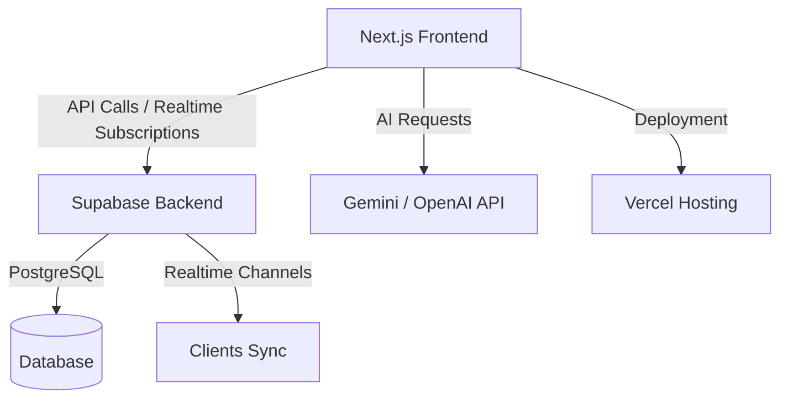

# Project Issues

> A fast, modern, and collaborative issue tracking and project management tool inspired by [Linear.app](https://linear.app).
> Built for teams who value speed, clarity, and beautiful design.

---

## Overview

**Project Issues** is a lightweight yet powerful issue and project management platform designed for modern software teams.
It emphasizes performance, clarity, and real-time collaboration through a clean, keyboard-driven interface.

Key design principles:

* Speed-first user experience
* Real-time collaboration
* Intuitive keyboard navigation
* Minimal, focused interface


## Core Features

### MVP (Phase 1)

* **Authentication**

  * Email and password login via Supabase Auth
  * Workspace-based access control
* **Workspaces and Teams**

  * Create, invite, and manage team members
  * Role-based permissions (Admin, Member)
* **Projects**

  * Create and organize projects within a workspace
  * Custom colors and icons
* **Issues**

  * Create, update, and manage issues
  * Fields: title, description, labels, priority, status
  * Drag-and-drop Kanban board
  * Markdown support for descriptions
* **Sprints / Cycles**

  * Define sprints with start and end dates
  * Track goals and completion progress
* **Comments and Activity**

  * Threaded comments with mentions (`@username`)
  * Real-time updates via Supabase Realtime
* **Keyboard Shortcuts**

  * Command palette (`⌘ + K`)
  * Quick issue creation (`⌘ + I`)
* **UI and UX**

  * Dark/light mode
  * Optimistic UI updates for instant feedback

### Extended (Phase 2)

* Full-text search and advanced filters
* Analytics dashboard (burndown and sprint velocity charts)
* Custom labels and issue templates
* File attachments via Supabase Storage
* Notification center (in-app and email)
* Workspace activity feed
* Global command palette

### AI (Phase 3)

* AI-generated issue titles and summaries
* AI sprint planner
* Smart issue categorization
* Semantic search for natural language queries


## Tech Stack

| Layer              | Technology                                     |
| ------------------ | ---------------------------------------------- |
| Frontend           | Next.js 15, TypeScript                         |
| Styling            | TailwindCSS, shadcn/ui, Framer Motion          |
| State Management   | Zustand or Redux Toolkit                       |
| Backend & Database | Supabase (PostgreSQL, Auth, Realtime, Storage) |
| AI Layer           | Gemini API / OpenAI API                        |
| Deployment         | Vercel (frontend), Supabase Cloud (backend)    |
| Testing            | Jest, Playwright                               |
| Analytics          | PostHog or Supabase Logs                       |

---

## Architecture Overview




## Local Development Setup

### 1. Prerequisites

* Node.js 18 or higher
* npm, yarn, or pnpm
* Supabase account
* (Optional) Gemini or OpenAI API key

### 2. Clone the Repository

```bash
git clone https://github.com/yonatanafewerk/project-issues.git
cd project-issues
```

### 3. Install Dependencies

```bash
pnpm install
# or
npm install
```

### 4. Configure Environment Variables

Create a `.env.local` file in the project root and add:

```bash
NEXT_PUBLIC_SUPABASE_URL=your_supabase_project_url
NEXT_PUBLIC_SUPABASE_ANON_KEY=your_supabase_anon_key
SUPABASE_SERVICE_ROLE_KEY=your_service_key
AI_API_KEY=your_gemini_or_openai_key
```

### 5. Start the Development Server

```bash
pnpm dev
# or
npm run dev
```

## License

This project is licensed under the MIT License.
You are free to use, modify, and distribute it under the same terms.


## Inspiration

> “Speed is the ultimate feature.” — *Linear Team*

Project Issues aims to deliver that same experience: a fast, elegant, and focused workspace for product teams.

